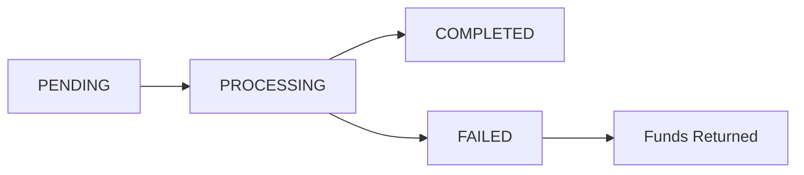

## Overview

This endpoint retrieves the current status and details of a withdrawal request, including transaction hash, confirmation status, and completion time.

Use this endpoint to track the progress of your withdrawals.

## Authentication

<ParamField header="X-API-Key" type="string" required>
  Your InventPay API key **Example:** `cmfnz7jei0005p54eekx4e6mb`
</ParamField>

## Path Parameters

<ParamField path="withdrawalId" type="string" required>
  The unique withdrawal identifier **Example:** `"cmh789ghi012jkl"`
</ParamField>

## Response

<ResponseField name="success" type="boolean">
  Indicates if the request was successful
</ResponseField>

<ResponseField name="data" type="object">
  Withdrawal details object
  <Expandable title="data properties">
    <ResponseField name="withdrawalId" type="string">
      Unique identifier for this withdrawal **Example:** `"cmh789ghi012jkl"`
    </ResponseField>

    <ResponseField name="amount" type="string">
      Withdrawal amount **Example:** `"10"`
    </ResponseField>

    <ResponseField name="currency" type="string">
      The cryptocurrency **Example:** `"USDT_BEP20"`
    </ResponseField>

    <ResponseField name="destinationAddress" type="string">
      Destination wallet address **Example:**
      `"0x1E3D6848dE165e64052f0F2A3dA8823A27CAc22D"`
    </ResponseField>

    <ResponseField name="status" type="string">
      Current withdrawal status **Options:** `PENDING`, `PROCESSING`,
      `COMPLETED`, `FAILED` **Example:** `"COMPLETED"`
    </ResponseField>

    <ResponseField name="transactionHash" type="string">
      Blockchain transaction hash (available when processing or completed)
      **Example:** `"0x1234567890abcdef..."`
    </ResponseField>

    <ResponseField name="feeAmount" type="string">
      Total fee amount **Example:** `"0.051"`
    </ResponseField>

    <ResponseField name="metadata" type="object">
      Additional withdrawal information
      <Expandable title="metadata properties">
        <ResponseField name="netAmount" type="number">
          Amount after fees **Example:** `9.949`
        </ResponseField>

        <ResponseField name="networkFee" type="number">
          Blockchain network fee **Example:** `0.001`
        </ResponseField>

        <ResponseField name="serviceFee" type="number">
          InventPay service fee **Example:** `0.05`
        </ResponseField>

        <ResponseField name="confirmations" type="number">
          Number of blockchain confirmations (if available) **Example:** `15`
        </ResponseField>
      </Expandable>
    </ResponseField>

    <ResponseField name="createdAt" type="string">
      Withdrawal creation timestamp (ISO 8601) **Example:**
      `"2024-01-01T12:00:00.000Z"`
    </ResponseField>

    <ResponseField name="processedAt" type="string">
      When withdrawal was submitted to blockchain (ISO 8601) **Example:**
      `"2024-01-01T12:05:00.000Z"`
    </ResponseField>

    <ResponseField name="completedAt" type="string">
      When withdrawal was completed (ISO 8601) **Example:**
      `"2024-01-01T12:20:00.000Z"`
    </ResponseField>

    <ResponseField name="description" type="string">
      Withdrawal description (if provided) **Example:** `"Monthly payout"`
    </ResponseField>

    <ResponseField name="failureReason" type="string">
      Reason for failure (only present if status is FAILED) **Example:**
      `"Insufficient network funds"`
    </ResponseField>
  </Expandable>
</ResponseField>

<ResponseField name="message" type="string">
  Success message **Example:** `"Withdrawal retrieved successfully"`
</ResponseField>

<ResponseField name="statusCode" type="number">
  HTTP status code **Example:** `200`
</ResponseField>

## Example Request

<CodeGroup>

```bash cURL
curl -X GET https://api.inventpay.io/v1/withdrawal/cmh789ghi012jkl \
  -H "X-API-Key: YOUR_API_KEY"
```

```javascript JavaScript/TypeScript
const withdrawal = await sdk.getWithdrawal("cmh789ghi012jkl");

console.log("Status:", withdrawal.data.status);
console.log("Transaction Hash:", withdrawal.data.transactionHash);

if (withdrawal.data.status === "COMPLETED") {
  console.log("Completed at:", withdrawal.data.completedAt);
}
```

```python Python
withdrawal = sdk.get_withdrawal("cmh789ghi012jkl")

print(f"Status: {withdrawal.data['status']}")
print(f"Transaction Hash: {withdrawal.data.get('transactionHash')}")

if withdrawal.data['status'] == "COMPLETED":
    print(f"Completed at: {withdrawal.data['completedAt']}")
```

</CodeGroup>

## Example Response

```json 200 - Pending Withdrawal
{
  "success": true,
  "data": {
    "withdrawalId": "cmh789ghi012jkl",
    "amount": "10",
    "currency": "USDT_BEP20",
    "destinationAddress": "0x1E3D6848dE165e64052f0F2A3dA8823A27CAc22D",
    "status": "PENDING",
    "feeAmount": "0.051",
    "metadata": {
      "netAmount": 9.949,
      "networkFee": 0.001,
      "serviceFee": 0.05
    },
    "createdAt": "2024-01-01T12:00:00.000Z",
    "description": "Monthly payout"
  },
  "message": "Withdrawal retrieved successfully",
  "statusCode": 200
}
```

```json 200 - Processing Withdrawal
{
  "success": true,
  "data": {
    "withdrawalId": "cmh789ghi012jkl",
    "amount": "10",
    "currency": "USDT_BEP20",
    "destinationAddress": "0x1E3D6848dE165e64052f0F2A3dA8823A27CAc22D",
    "status": "PROCESSING",
    "transactionHash": "0x1234567890abcdef1234567890abcdef1234567890abcdef1234567890abcdef",
    "feeAmount": "0.051",
    "metadata": {
      "netAmount": 9.949,
      "networkFee": 0.001,
      "serviceFee": 0.05,
      "confirmations": 5
    },
    "createdAt": "2024-01-01T12:00:00.000Z",
    "processedAt": "2024-01-01T12:05:00.000Z",
    "description": "Monthly payout"
  },
  "message": "Withdrawal retrieved successfully",
  "statusCode": 200
}
```

```json 200 - Completed Withdrawal
{
  "success": true,
  "data": {
    "withdrawalId": "cmh789ghi012jkl",
    "amount": "10",
    "currency": "USDT_BEP20",
    "destinationAddress": "0x1E3D6848dE165e64052f0F2A3dA8823A27CAc22D",
    "status": "COMPLETED",
    "transactionHash": "0x1234567890abcdef1234567890abcdef1234567890abcdef1234567890abcdef",
    "feeAmount": "0.051",
    "metadata": {
      "netAmount": 9.949,
      "networkFee": 0.001,
      "serviceFee": 0.05,
      "confirmations": 15
    },
    "createdAt": "2024-01-01T12:00:00.000Z",
    "processedAt": "2024-01-01T12:05:00.000Z",
    "completedAt": "2024-01-01T12:20:00.000Z",
    "description": "Monthly payout"
  },
  "message": "Withdrawal retrieved successfully",
  "statusCode": 200
}
```

```json 200 - Failed Withdrawal
{
  "success": true,
  "data": {
    "withdrawalId": "cmh789ghi012jkl",
    "amount": "10",
    "currency": "USDT_BEP20",
    "destinationAddress": "0x1E3D6848dE165e64052f0F2A3dA8823A27CAc22D",
    "status": "FAILED",
    "feeAmount": "0.051",
    "failureReason": "Insufficient network funds for gas",
    "metadata": {
      "netAmount": 9.949,
      "networkFee": 0.001,
      "serviceFee": 0.05
    },
    "createdAt": "2024-01-01T12:00:00.000Z",
    "description": "Monthly payout"
  },
  "message": "Withdrawal retrieved successfully",
  "statusCode": 200
}
```

```json 404 - Withdrawal Not Found
{
  "success": false,
  "error": "Withdrawal not found",
  "statusCode": 404
}
```

```json 401 - Unauthorized
{
  "success": false,
  "error": "Invalid API key",
  "statusCode": 401
}
```

## Withdrawal Status Lifecycle



| Status       | Description                         | Next Action                     |
| ------------ | ----------------------------------- | ------------------------------- |
| `PENDING`    | Withdrawal queued for processing    | Wait for system to process      |
| `PROCESSING` | Transaction submitted to blockchain | Wait for confirmations          |
| `COMPLETED`  | Transaction confirmed on blockchain | No action needed                |
| `FAILED`     | Withdrawal failed, funds returned   | Create new withdrawal if needed |

## Tracking on Blockchain

Once a withdrawal is `PROCESSING` or `COMPLETED`, you can track it on the blockchain explorer:

| Network  | Explorer URL                                                    |
| -------- | --------------------------------------------------------------- |
| Bitcoin  | `https://blockchair.com/bitcoin/transaction/{transactionHash}`  |
| Ethereum | `https://etherscan.io/tx/{transactionHash}`                     |
| BSC      | `https://bscscan.com/tx/{transactionHash}`                      |
| Litecoin | `https://blockchair.com/litecoin/transaction/{transactionHash}` |

<Tip>
  Copy the `transactionHash` from the response and paste it into the appropriate
  blockchain explorer to see real-time confirmation status.
</Tip>

## Failed Withdrawals

If a withdrawal fails:

1. **Funds are automatically returned** to your available balance
2. **Check the `failureReason`** to understand why it failed
3. **Resolve the issue** (e.g., wait for network congestion to clear)
4. **Create a new withdrawal** once the issue is resolved

Common failure reasons:

- Network congestion (high gas prices)
- Insufficient network funds for transaction
- Invalid destination address
- Blockchain network issues

## Error Codes

| Status Code | Description                       |
| ----------- | --------------------------------- |
| 200         | Withdrawal retrieved successfully |
| 404         | Withdrawal not found              |
| 401         | Invalid or missing API key        |
| 429         | Rate limit exceeded               |
| 500         | Internal server error             |
