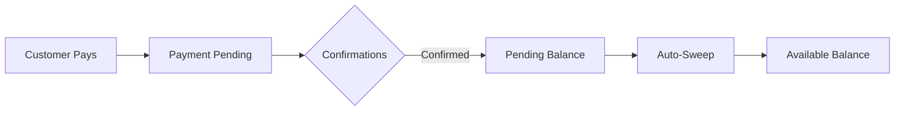

## Overview

Your InventPay account maintains separate balances for each cryptocurrency. Understanding how balances work helps you manage your funds effectively and plan withdrawals.

## Balance Components

Each cryptocurrency balance consists of four key components:

<CardGroup cols={2}>
  <Card title="Available Balance" icon="circle-check">
    **What it is:** Funds ready for immediate withdrawal
    
    **Includes:** Confirmed payments that have been swept to your account
    
    **Use for:** Withdrawals, business operations
  </Card>

{" "}
<Card title="Pending Balance" icon="clock">
  **What it is:** Funds awaiting blockchain confirmations **Includes:** Payments
  received but not yet confirmed **Becomes:** Available balance after
  confirmation
</Card>

{" "}
<Card title="Total Earned" icon="chart-line-up">
  **What it is:** Lifetime total of all payments received **Includes:** All
  confirmed payments, ever **Use for:** Analytics, reporting, accounting
</Card>

  <Card title="Total Withdrawn" icon="arrow-right-from-bracket">
    **What it is:** Lifetime total of all withdrawals made
    
    **Includes:** All completed withdrawals, ever
    
    **Use for:** Financial tracking, reconciliation
  </Card>
</CardGroup>

## Balance Calculation

Understanding the relationship between balance components:

```
Available Balance = Total Earned - Total Withdrawn - Pending Balance
```

### Example Scenario

```json
{
  "currency": "USDT_BEP20",
  "availableBalance": 1500.75,
  "pendingBalance": 250.5,
  "totalEarned": 5000.0,
  "totalWithdrawn": 3248.75
}
```

**Explanation:**

- **Total Earned:** $5,000 received from customers
- **Total Withdrawn:** $3,248.75 sent to your wallet
- **Pending:** $250.50 awaiting confirmation
- **Available:** $1,500.75 ready to withdraw

## How Balances Grow

### Payment Flow to Balance



<Steps>
  <Step title="Customer Sends Payment">
    Customer transfers cryptocurrency to unique payment address
  </Step>
  <Step title="Transaction Detected">
    InventPay detects the transaction on the blockchain
  </Step>
  <Step title="Pending Balance">
    Funds appear in pending balance while awaiting confirmations
  </Step>
  <Step title="Confirmations Complete">
    Required confirmations reached (3-15 blocks depending on currency)
  </Step>
  <Step title="Auto-Sweep">
    Funds automatically swept from payment address to your master wallet
  </Step>
  <Step title="Available Balance">Funds now available for withdrawal</Step>
</Steps>

## Multi-Currency Balances

Your account maintains separate balances for each cryptocurrency:

### Example Balance Overview

| Currency   | Available | Pending  | Total Earned | Total Withdrawn |
| ---------- | --------- | -------- | ------------ | --------------- |
| BTC        | 0.5 BTC   | 0.1 BTC  | 1.2 BTC      | 0.7 BTC         |
| ETH        | 2.1 ETH   | 0.3 ETH  | 5.6 ETH      | 3.5 ETH         |
| LTC        | 15.5 LTC  | 2.0 LTC  | 50.0 LTC     | 34.5 LTC        |
| USDT_ERC20 | 500 USDT  | 100 USDT | 2000 USDT    | 1500 USDT       |
| USDT_BEP20 | 1500 USDT | 250 USDT | 5000 USDT    | 3250 USDT       |

<Info>
  Each currency is completely separate. You cannot combine balances or convert
  between currencies within InventPay.
</Info>

## Checking Your Balance

### Using the API

<CodeGroup>

```javascript JavaScript/TypeScript
// Get all balances
const balances = await sdk.getBalances();
console.log(balances.data.balances);

// Get specific currency
const usdtBalance = await sdk.getBalance("USDT_BEP20");
console.log(usdtBalance.data.balance.availableBalance);
```

```python Python
# Get all balances
balances = sdk.get_balances()
print(balances.data['balances'])

# Get specific currency
usdt_balance = sdk.get_balance("USDT_BEP20")
print(usdt_balance.data['balance']['availableBalance'])
```

```bash cURL
# Get all balances
curl -X GET https://api.inventpay.io/v1/merchant/balance \
  -H "X-API-Key: YOUR_API_KEY"

# Get specific currency
curl -X GET https://api.inventpay.io/v1/merchant/balance/USDT_BEP20 \
  -H "X-API-Key: YOUR_API_KEY"
```

</CodeGroup>

### Using the Dashboard

1. Log in to [InventPay Dashboard](https://inventpay.io/dashboard)
2. Navigate to **Balances**
3. View all currencies at a glance
4. Click any currency for detailed history

<Card title="View Balances" icon="wallet" href="/api-reference/get-balances">
  Learn more about the Get Balances API
</Card>

## Withdrawal Limits

To ensure security, withdrawal limits are in place for each currency:

### Daily Limits

Default daily withdrawal limits by currency:

| Currency   | Daily Limit | Resets         |
| ---------- | ----------- | -------------- |
| BTC        | 10 BTC      | Every 24 hours |
| ETH        | 50 ETH      | Every 24 hours |
| LTC        | 500 LTC     | Every 24 hours |
| USDT_ERC20 | 10,000 USDT | Every 24 hours |
| USDT_BEP20 | 10,000 USDT | Every 24 hours |

### Monthly Limits

Additional monthly limits for larger operations:

| Currency   | Monthly Limit | Resets       |
| ---------- | ------------- | ------------ |
| BTC        | 100 BTC       | 1st of month |
| ETH        | 500 ETH       | 1st of month |
| LTC        | 5,000 LTC     | 1st of month |
| USDT_ERC20 | 100,000 USDT  | 1st of month |
| USDT_BEP20 | 100,000 USDT  | 1st of month |

<Warning>
  Attempting to withdraw more than your limit will result in an error. Plan
  withdrawals accordingly or contact support for higher limits.
</Warning>

### Checking Available Limits

Your balance response includes current limit status:

```json
{
  "limits": {
    "daily": {
      "limit": 10000,
      "used": 1500,
      "remaining": 8500,
      "resetAt": "2024-01-02T00:00:00.000Z"
    },
    "monthly": {
      "limit": 100000,
      "used": 15000,
      "remaining": 85000,
      "resetAt": "2024-02-01T00:00:00.000Z"
    }
  }
}
```

### Requesting Higher Limits

Need higher withdrawal limits? Contact our support team:

<Steps>
  <Step title="Contact Support">
    Email support@inventpay.io with your request
  </Step>
  <Step title="Provide Business Info">
    Share your business details and expected volumes
  </Step>
  <Step title="Review Process">
    We'll review your account and transaction history
  </Step>
  <Step title="Limit Increase">
    Approved increases take effect within 24 hours
  </Step>
</Steps>

## Auto-Sweep System

InventPay automatically consolidates funds from payment addresses to your master wallet.

### How Auto-Sweep Works

1. **Payment Confirmed:** Required confirmations reached
2. **Sweep Triggered:** System queues automatic transfer
3. **Funds Consolidated:** Moved to your master wallet
4. **Balance Updated:** Available balance increases

### Benefits of Auto-Sweep

<CardGroup cols={2}>
  <Card title="Automatic" icon="wand-magic-sparkles">
    No manual intervention required
  </Card>
  <Card title="Secure" icon="shield-check">
    Funds moved to secure master wallet immediately
  </Card>
  <Card title="Efficient" icon="bolt">
    Batch processing minimizes network fees
  </Card>
  <Card title="Real-time" icon="clock">
    Available balance updates in real-time
  </Card>
</CardGroup>

<Info>
  Auto-sweep is enabled by default and cannot be disabled. This ensures maximum
  security by minimizing funds in individual payment addresses.
</Info>

## Balance Notifications

Stay informed about balance changes:

### Webhook Events

- `payment.completed` - Balance increased by completed payment
- `withdrawal.completed` - Balance decreased by withdrawal
- `balance.low` - Balance below threshold (configurable)

### Dashboard Alerts

- Email notifications for large transactions
- Low balance warnings
- Daily balance summaries

<Card title="Configure Webhooks" icon="webhook" href="/webhooks/setup">
  Set up balance notifications via webhooks
</Card>

## Minimum Balances for Withdrawal

Each cryptocurrency has minimum withdrawal amounts:

| Currency   | Minimum Withdrawal |
| ---------- | ------------------ |
| BTC        | 0.001 BTC          |
| ETH        | 0.01 ETH           |
| LTC        | 0.1 LTC            |
| USDT_ERC20 | 10 USDT            |
| USDT_BEP20 | 10 USDT            |

<Note>
  Minimum withdrawals exist to ensure network fees don't consume a large
  percentage of your withdrawal.
</Note>

## Fee Impact on Balance

### Payment Fees

InventPay charges a small fee on incoming payments:

- **Standard Fee:** 0.5% per payment
- **Fee Deduction:** Taken before crediting to available balance
- **Minimum Fee:** None
- **Maximum Fee:** None

**Example:**

```
Customer Payment: 100 USDT
Platform Fee (0.5%): 0.50 USDT
Credited to Balance: 99.50 USDT
```

### Withdrawal Fees

Withdrawals include two types of fees:

1. **Network Fee:** Blockchain transaction cost (variable)
2. **Service Fee:** 0.5% of withdrawal amount

**Example:**

```
Withdrawal Amount: 100 USDT
Service Fee (0.5%): 0.50 USDT
Network Fee: ~0.10 USDT (BEP-20)
Total Deducted: 100.60 USDT
Recipient Receives: 100 USDT
```

<Card
  title="Create Withdrawal"
  icon="arrow-right-from-bracket"
  href="/api-reference/create-withdrawal"
>
  Learn more about withdrawals and fees
</Card>

## Balance Security

Your balances are protected by multiple security layers:

<AccordionGroup>
  <Accordion title="Cold Storage" icon="snowflake">
    Majority of funds stored in offline cold wallets
  </Accordion>

  <Accordion title="Multi-Signature" icon="key">
    Withdrawals require multiple signatures for approval
  </Accordion>

  <Accordion title="Rate Limiting" icon="shield-halved">
    Automatic limits prevent unauthorized large withdrawals
  </Accordion>

  <Accordion title="Monitoring" icon="eye">
    24/7 monitoring of all balance changes
  </Accordion>

  <Accordion title="Insurance" icon="umbrella">
    Funds protected by insurance policy
  </Accordion>
</AccordionGroup>

## Best Practices

<Steps>
  <Step title="Regular Withdrawals">
    Withdraw funds regularly to your own wallets for maximum security
  </Step>
  <Step title="Monitor Limits">
    Check daily/monthly limits before planning large withdrawals
  </Step>
  <Step title="Track Pending">
    Monitor pending balance to anticipate incoming funds
  </Step>
  <Step title="Plan for Fees">
    Account for withdrawal fees in your financial planning
  </Step>
  <Step title="Use Webhooks">
    Automate balance tracking with webhook notifications
  </Step>
</Steps>

## Troubleshooting

<AccordionGroup>
  <Accordion title="Balance Not Updating" icon="circle-question">
    **Cause:** Payment may still be pending confirmations **Solution:** Check
    payment status and confirmation count
  </Accordion>

  <Accordion
    title="Available Balance Lower Than Expected"
    icon="circle-question"
  >
    **Cause:** Fees deducted or withdrawal limit reached **Solution:** Review
    transaction history and limit status
  </Accordion>

  <Accordion title="Cannot Withdraw Full Balance" icon="circle-question">
    **Cause:** Daily/monthly limit reached or minimum not met **Solution:**
    Check limit status or wait for limit reset
  </Accordion>
</AccordionGroup>

## Next Steps

<CardGroup cols={2}>
  <Card
    title="Check Balance"
    icon="magnifying-glass-dollar"
    href="/api-reference/get-balances"
  >
    View the Get Balances API endpoint
  </Card>
  <Card
    title="Withdraw Funds"
    icon="money-bill-transfer"
    href="/concepts/withdrawals"
  >
    Learn about withdrawing your balance
  </Card>
  <Card
    title="View Transactions"
    icon="list"
    href="https://inventpay.io/dashboard"
  >
    See transaction history in dashboard
  </Card>
  <Card title="Webhooks" icon="webhook" href="/webhooks/overview">
    Automate balance notifications
  </Card>
</CardGroup>
