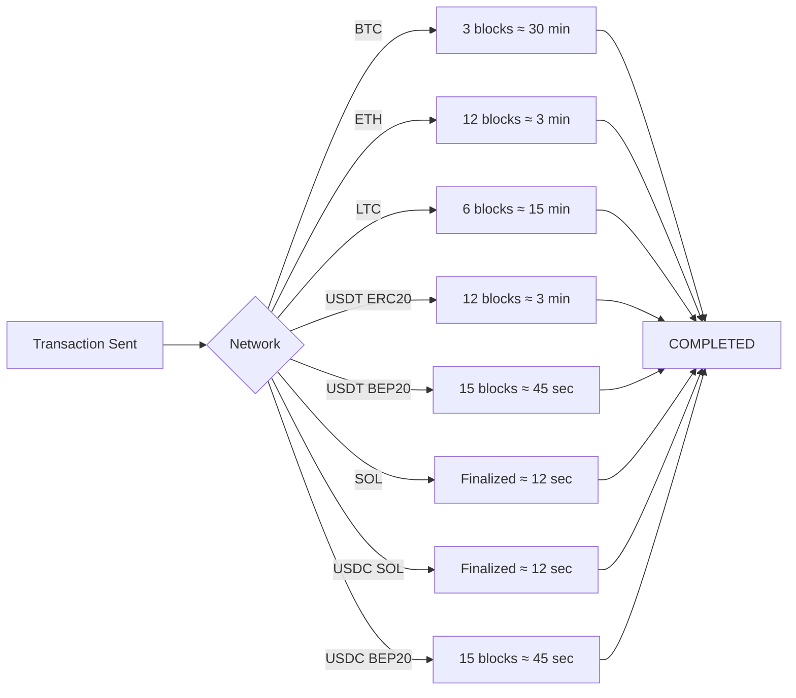

## Supported Cryptocurrencies

InventPay supports eight major cryptocurrencies across multiple blockchain networks, giving you and your customers flexibility in payment options.

## Available Currencies

<CardGroup cols={2}>
  <Card title="Bitcoin (BTC)" icon="bitcoin">
    **Network:** Bitcoin Mainnet
    
    **Code:** `BTC`
    
    **Confirmations:** 3 blocks (~30 min)
    
    **Min Amount:** 0.001 BTC
  </Card>

{" "}
<Card title="Ethereum (ETH)" icon="ethereum">
  **Network:** Ethereum Mainnet **Code:** `ETH` **Confirmations:** 12 blocks (~3
  min) **Min Amount:** 0.01 ETH
</Card>

{" "}
<Card title="Litecoin (LTC)" icon="coins">
  **Network:** Litecoin Mainnet **Code:** `LTC` **Confirmations:** 6 blocks (~15
  min) **Min Amount:** 0.1 LTC
</Card>

{" "}
<Card title="USDT (ERC-20)" icon="dollar-sign">
  **Network:** Ethereum (ERC-20) **Code:** `USDT_ERC20` **Confirmations:** 12
  blocks (~3 min) **Min Amount:** 10 USDT
</Card>

  <Card title="USDT (BEP-20)" icon="dollar-sign">
    **Network:** Binance Smart Chain

    **Code:** `USDT_BEP20`

    **Confirmations:** 15 blocks (~45 sec)

    **Min Amount:** 10 USDT
  </Card>

  <Card title="Solana (SOL)" icon="bolt">
    **Network:** Solana Mainnet

    **Code:** `SOL`

    **Confirmations:** Finalized (~12 sec)

    **Min Amount:** 0.1 SOL
  </Card>

  <Card title="USDC (Solana)" icon="dollar-sign">
    **Network:** Solana (SPL Token)

    **Code:** `USDC_SOL`

    **Confirmations:** Finalized (~12 sec)

    **Min Amount:** 5 USDC
  </Card>

  <Card title="USDC (BEP-20)" icon="dollar-sign">
    **Network:** Binance Smart Chain

    **Code:** `USDC_BEP20`

    **Confirmations:** 15 blocks (~45 sec)

    **Min Amount:** 5 USDC
  </Card>
</CardGroup>

## Currency Codes

When creating payments or invoices, use these exact currency codes:

| Cryptocurrency  | Code         | Network             |
| --------------- | ------------ | ------------------- |
| Bitcoin         | `BTC`        | Bitcoin Mainnet     |
| Ethereum        | `ETH`        | Ethereum Mainnet    |
| Litecoin        | `LTC`        | Litecoin Mainnet    |
| Tether (ERC-20) | `USDT_ERC20` | Ethereum            |
| Tether (BEP-20) | `USDT_BEP20` | Binance Smart Chain |
| Solana           | `SOL`        | Solana Mainnet      |
| USDC (Solana)    | `USDC_SOL`   | Solana              |
| USDC (BEP-20)    | `USDC_BEP20` | Binance Smart Chain |

<Warning>
  Always use the exact code as shown. Currency codes are case-sensitive.
</Warning>

## Understanding USDT Networks

USDT (Tether) is available on multiple blockchain networks. InventPay supports two:

### USDT_ERC20 (Ethereum)

**Advantages:**

- Most widely supported
- High liquidity
- Established network

**Considerations:**

- Higher gas fees
- Slower during network congestion
- ~3 minutes for confirmations

**Best for:**

- Large transactions where fees are negligible
- Maximum compatibility
- Users with Ethereum wallets

### USDT_BEP20 (Binance Smart Chain)

**Advantages:**

- Much lower fees
- Faster confirmations (~45 seconds)
- Growing ecosystem

**Considerations:**

- Requires BSC-compatible wallet
- Less universal than ERC-20

**Best for:**

- Smaller transactions where fees matter
- Frequent transactions
- Users familiar with BSC

<Tip>
  For most use cases, we recommend **USDT_BEP20** due to lower fees and faster
  confirmations. However, always consider your customers' wallet capabilities.
</Tip>

## Understanding Solana & USDC

### Solana (SOL)

Solana is a high-performance blockchain known for extremely fast finality and low transaction costs.

**Advantages:**

- Ultra-fast finality (~12 seconds)
- Extremely low fees (fractions of a cent)
- Growing DeFi and NFT ecosystem
- High throughput (thousands of TPS)

**Considerations:**

- Requires a Solana-compatible wallet (Phantom, Solflare, etc.)
- Newer ecosystem compared to Ethereum

**Best for:**

- High-frequency, low-value transactions
- Applications targeting the Solana ecosystem
- Users who want near-instant confirmations

### USDC on Solana vs BEP-20

USDC is available on multiple networks. InventPay supports two:

**USDC_SOL (Solana):**

- Fastest confirmations (~12 seconds finalized)
- Lowest fees (fractions of a cent)
- Growing adoption in DeFi
- Requires Solana wallet

**USDC_BEP20 (Binance Smart Chain):**

- Fast confirmations (~45 seconds)
- Low fees ($0.10-0.50)
- BSC ecosystem compatibility
- Requires BSC-compatible wallet

<Tip>
  **USDC_SOL** offers the fastest and cheapest USDC transfers. Choose it when your
  customers use Solana wallets. Use **USDC_BEP20** for BSC ecosystem users.
</Tip>

## Network Selection Guide

Choosing the right network is crucial for your customers' experience:

<AccordionGroup>
  <Accordion title="For E-commerce" icon="cart-shopping">
    **Recommended:** `USDT_BEP20`, `USDC_SOL`, or create multi-currency invoices

    - Lower fees encourage completion
    - Fast confirmations improve UX
    - Stable value (pegged to USD)
    - SOL/USDC_SOL offers near-instant finality
  </Accordion>

{" "}
<Accordion title="For High-Value B2B" icon="building">
  **Recommended:** `BTC` or `ETH` - Network fees are negligible on large amounts
  - Most established and trusted - Better for accounting/auditing
</Accordion>

{" "}
<Accordion title="For Subscriptions" icon="rotate">
  **Recommended:** `USDT_BEP20` - Low fees for recurring payments - Stable value
  simplifies pricing - Fast processing
</Accordion>

  <Accordion title="For Global Reach" icon="globe">
    **Recommended:** Multi-currency invoices
    
    - Let customers choose their preferred crypto
    - Maximize conversion rates
    - Accommodate different regions
  </Accordion>
</AccordionGroup>

## Amount Currencies

When specifying amounts in API requests, you can denominate in different currencies:

### Supported Amount Currencies

| Currency  | Code   | Use Case                  |
| --------- | ------ | ------------------------- |
| US Dollar | `USD`  | Most common, easy pricing |
| Tether    | `USDT` | Crypto-native pricing     |
| Bitcoin   | `BTC`  | BTC-denominated pricing   |
| Ethereum  | `ETH`  | ETH-denominated pricing   |
| Litecoin  | `LTC`  | LTC-denominated pricing   |
| Solana    | `SOL`  | SOL-denominated pricing   |

### Example: USD-based Pricing

```json
{
  "amount": 29.99,
  "amountCurrency": "USD",
  "currency": "USDT_BEP20"
}
```

**Result:** Customer pays equivalent of $29.99 in USDT on BSC

### Example: Crypto-based Pricing

```json
{
  "amount": 0.001,
  "amountCurrency": "BTC",
  "currency": "BTC"
}
```

**Result:** Customer pays exactly 0.001 BTC (no conversion)

<Info>
  Using USD as `amountCurrency` is recommended for most businesses as it
  provides stable, predictable pricing regardless of crypto volatility.
</Info>

## Real-Time Exchange Rates

InventPay uses real-time exchange rates from multiple sources to ensure accurate conversions.

### How Rates Work

1. **Rate Fetching:** Aggregated from multiple exchanges
2. **Rate Locking:** Locked when payment is created
3. **Rate Duration:** Valid until payment expiration
4. **No Slippage:** Customer pays exact amount shown

### Rate Sources

- Binance
- Coinbase
- Kraken
- Additional aggregators

<Note>
  Exchange rates are locked at payment creation, protecting both you and your
  customers from volatility during the payment window.
</Note>

## Minimum Payment Amounts

Each cryptocurrency has minimum payment amounts to ensure economic viability:

| Currency   | Minimum Amount   | Reason                     |
| ---------- | ---------------- | -------------------------- |
| BTC        | 0.001 BTC (~$40) | Network fee considerations |
| ETH        | 0.01 ETH (~$20)  | Gas fee considerations     |
| LTC        | 0.1 LTC (~$7)    | Network fee considerations |
| USDT_ERC20 | 10 USDT          | Gas fee considerations     |
| USDT_BEP20 | 10 USDT          | Processing efficiency      |
| SOL        | 0.1 SOL (~$15)   | Network fee considerations |
| USDC_SOL   | 5 USDC           | Processing efficiency      |
| USDC_BEP20 | 5 USDC           | Processing efficiency      |

<Warning>
  Payments below minimum amounts will be rejected at creation. Always validate
  amounts before creating payment requests.
</Warning>

## Network Fees

Understanding network fees helps you choose the right cryptocurrency:

### Comparative Fee Structure

| Currency   | Typical Fee | Fee Type                  |
| ---------- | ----------- | ------------------------- |
| BTC        | $2-10       | Variable (network demand) |
| ETH        | $1-20       | Variable (gas price)      |
| LTC        | $0.01-0.10  | Low and stable            |
| USDT_ERC20 | $1-20       | Variable (gas price)      |
| USDT_BEP20 | $0.10-0.50  | Low and stable            |
| SOL        | $0.001-0.01 | Ultra-low and stable      |
| USDC_SOL   | $0.001-0.01 | Ultra-low and stable      |
| USDC_BEP20 | $0.10-0.50  | Low and stable            |

<Tip>
  **Customer pays network fees** when sending payment. **You pay network fees**
  when withdrawing funds. Choose networks wisely to minimize costs.
</Tip>

## Blockchain Confirmations

Each network requires different confirmation counts:

### Confirmation Requirements



### Why Different Confirmation Counts?

- **Security:** More confirmations = more secure
- **Block Time:** Faster blocks need more confirmations
- **Network Risk:** Risk of chain reorganization
- **Industry Standards:** Based on exchange best practices

## Address Formats

Each cryptocurrency uses different address formats:

### Format Examples

<CodeGroup>

```text Bitcoin (BTC)
bc1qxy2kgdygjrsqtzq2n0yrf2493p83kkfjhx0wlh
```

```text Ethereum (ETH)
0x742d35Cc6634C0532925a3b844Bc9e7595f0bEb
```

```text Litecoin (LTC)
ltc1qxy2kgdygjrsqtzq2n0yrf2493p83kkfhx0wlh
```

```text USDT (ERC-20)
0x742d35Cc6634C0532925a3b844Bc9e7595f0bEb
```

```text USDT (BEP-20)
0x742d35Cc6634C0532925a3b844Bc9e7595f0bEb
```

```text Solana (SOL) / USDC (Solana)
7EcDhSYGxXyscszYEp35KHN8vvw3svAuLKTzXwCFLtV
```

```text USDC (BEP-20)
0x742d35Cc6634C0532925a3b844Bc9e7595f0bEb
```

</CodeGroup>

<Warning>
  **CRITICAL:** USDT_ERC20, USDT_BEP20, and USDC_BEP20 use similar address formats (0x...) but are on
  different networks. Solana addresses are completely different (Base58 format). Sending to the wrong network will result in loss of funds!
</Warning>

## Best Practices

<Steps>
  <Step title="Always Specify Network">
    When accepting USDT or USDC, clearly communicate which network (ERC-20, BEP-20, or Solana)
  </Step>
  <Step title="Consider Your Audience">
    Choose currencies your customers are likely to have
  </Step>
  <Step title="Balance Fees and Speed">
    Higher fees often mean faster confirmations
  </Step>
  <Step title="Use Multi-Currency for Consumers">
    Let customers choose their preferred cryptocurrency
  </Step>
  <Step title="Test All Networks">
    Test USDT, USDC, and SOL on all supported networks before going live
  </Step>
</Steps>

## Currency Support Roadmap

We're constantly adding support for more cryptocurrencies:

### Coming Soon

- Polygon (MATIC)
- USDC (ERC-20)
- USDT (Solana / SPL)

### Under Consideration

- Cardano (ADA)
- Ripple (XRP)
- Avalanche (AVAX)

<Card title="Request a Currency" icon="plus" href="mailto:support@inventpay.io">
  Need a specific cryptocurrency? Contact us to share your use case
</Card>

## Next Steps

<CardGroup cols={2}>
  <Card
    title="Create Payment"
    icon="money-bill"
    href="/api-reference/create-payment"
  >
    Start accepting payments in these currencies
  </Card>
  <Card title="View Balances" icon="wallet" href="/concepts/balances">
    Learn how balances work across currencies
  </Card>
  <Card
    title="Withdrawals"
    icon="arrow-right-from-bracket"
    href="/concepts/withdrawals"
  >
    Understand how to withdraw your funds
  </Card>
  <Card
    title="Exchange Rates"
    icon="chart-line"
    href="/api-reference/get-payment-status"
  >
    See how rates are calculated
  </Card>
</CardGroup>
