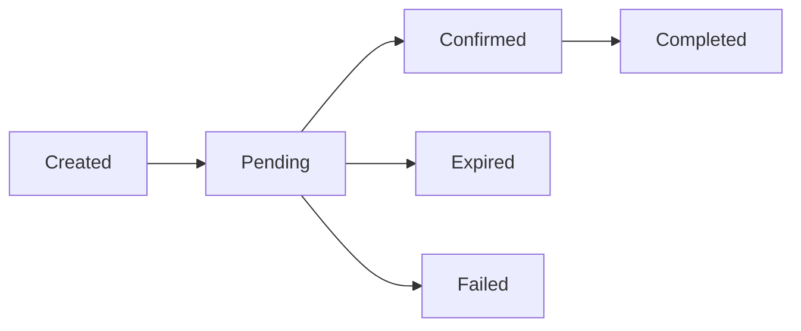

## Overview

InventPay supports two types of payment requests, each designed for different use cases. Understanding when to use each type will help you create the best payment experience for your customers.

## Payment Types

### Fixed Currency Payment

A **Fixed Currency Payment** generates an immediate payment address for a specific cryptocurrency. The customer must pay using that exact cryptocurrency.

**When to use:**

- You want to accept only a specific cryptocurrency
- You need an immediate payment address
- You're integrating with a system that only supports one crypto type
- You want to minimize customer confusion by showing only one payment option

**Example:**

```json
{
  "amount": 29.99,
  "amountCurrency": "USD",
  "currency": "USDT_BEP20",
  "orderId": "order-12345"
}
```

**Result:**

- Immediate wallet address: `0x742d35Cc6634C0532925a3b844Bc9e7595f0bEb`
- Fixed amount in crypto: `29.99 USDT`
- Customer must pay with USDT on BEP20 network

<Card
  title="Create Fixed Payment"
  icon="dollar-sign"
  href="/api-reference/create-payment"
>
  View the Create Payment API endpoint
</Card>

### Multi-Currency Invoice

A **Multi-Currency Invoice** lets customers choose which cryptocurrency they want to pay with. InventPay displays conversion rates for all supported cryptocurrencies.

**When to use:**

- You want to maximize payment flexibility
- Your customers use different cryptocurrencies
- You want to increase conversion rates by offering choices
- You're running a consumer-facing application

**Example:**

```json
{
  "amount": 49.99,
  "amountCurrency": "USD",
  "orderId": "order-67890"
}
```

**Result:**

- Invoice URL with currency selector
- Conversion rates for: BTC, ETH, LTC, USDT_ERC20, USDT_BEP20, SOL, USDC_SOL, USDC_BEP20
- Customer selects their preferred cryptocurrency
- Unique address generated after selection

<Card
  title="Create Invoice"
  icon="file-invoice-dollar"
  href="/api-reference/create-invoice"
>
  View the Create Invoice API endpoint
</Card>

## Payment Lifecycle

Every payment goes through a series of states from creation to completion:



### Payment States

<AccordionGroup>
  <Accordion title="PENDING" icon="clock">
    **Initial State:** Payment is waiting for funds to arrive
    
    - Payment address has been generated
    - Customer needs to send cryptocurrency
    - No funds received yet, or insufficient funds
    - Awaiting blockchain confirmations
    
    **Actions:**
    - Display payment address to customer
    - Show QR code for mobile wallets
    - Monitor for incoming transactions
  </Accordion>

{" "}
<Accordion title="COMPLETED" icon="circle-check">
  **Final State:** Payment successfully received and confirmed - Full payment
  amount received - Required confirmations reached - Funds available in your
  balance - Order can be fulfilled **Actions:** - Fulfill the order - Send
  confirmation to customer - Update your database
</Accordion>

{" "}
<Accordion title="EXPIRED" icon="calendar-xmark">
  **Final State:** Payment window closed without receiving payment - Expiration
  time reached - No payment or partial payment received - Payment address no
  longer monitored **Actions:** - Cancel the order - Create new payment if
  customer still wants to pay - Notify customer of expiration
</Accordion>

  <Accordion title="FAILED" icon="circle-xmark">
    **Final State:** Payment encountered an error
    
    - Technical error during processing
    - Invalid transaction detected
    - Blockchain issues
    
    **Actions:**
    - Contact support if error persists
    - Create new payment for customer
  </Accordion>
</AccordionGroup>

## Unique Payment Addresses

Every payment request generates a **unique wallet address** for security and tracking purposes.

### Benefits

<CardGroup cols={2}>
  <Card title="Enhanced Security" icon="shield-check">
    Each address is used only once, preventing address reuse attacks
  </Card>
  <Card title="Easy Tracking" icon="magnifying-glass">
    Instantly match incoming payments to specific orders
  </Card>
  <Card title="Privacy" icon="user-secret">
    Customers' payment activity remains private and isolated
  </Card>
  <Card title="Auto-Reconciliation" icon="check-double">
    Automatic payment matching eliminates manual reconciliation
  </Card>
</CardGroup>

### How It Works

1. **Customer initiates checkout** → You create a payment request
2. **InventPay generates unique address** → Specific to this transaction
3. **Customer sends crypto** → To the unique address
4. **InventPay monitors blockchain** → Tracks confirmations in real-time
5. **Payment confirmed** → Funds swept to your master wallet

## Payment Expiration

All payments have an expiration time to prevent indefinite address monitoring.

### Default Expiration

- **Fixed Payments:** 30 minutes
- **Invoices:** 60 minutes

### Custom Expiration

You can set custom expiration times between **5 and 1440 minutes** (24 hours):

```json
{
  "amount": 100,
  "currency": "BTC",
  "expirationMinutes": 120 // 2 hours
}
```

<Warning>
  After expiration, payments sent to the address will not be credited. Always
  create a new payment if the customer still wants to pay.
</Warning>

### Why Payments Expire

- **Resource Management:** Monitoring addresses indefinitely is resource-intensive
- **Price Protection:** Cryptocurrency prices fluctuate; expiration ensures rate accuracy
- **Abandoned Carts:** Prevents cluttering your system with abandoned payments
- **Customer Experience:** Creates urgency and reduces confusion

## Partial Payments

InventPay detects when a customer sends less than the required amount.

### Underpayment Detection

If a customer sends **less than 95%** of the required amount:

1. Payment status becomes `PENDING` with `underpaid` flag
2. Webhook notification sent: `payment.underpaid`
3. Remaining amount calculated and displayed
4. Customer can send additional payment to same address

**Example:**

```json
{
  "status": "PENDING",
  "requiredAmount": "100.00",
  "currentBalance": "90.00",
  "remainingAmount": "10.00",
  "paidPercentage": 90
}
```

### Handling Underpayments

<Steps>
  <Step title="Notify Customer">
    Inform them of the remaining amount needed
  </Step>
  <Step title="Allow Additional Payment">
    Same address can receive top-up payment before expiration
  </Step>
  <Step title="Set Deadline">Communicate expiration time clearly</Step>
  <Step title="Handle Expiration">
    If expired with underpayment, decide whether to accept partial payment or
    refund
  </Step>
</Steps>

<Info>
  If a payment expires while underpaid, contact support to discuss refund or
  manual completion options.
</Info>

## Overpayments

If a customer sends **more than required**, the entire amount is credited to your account.

**Example:**

- Required: `0.001 BTC`
- Customer sends: `0.0012 BTC`
- Result: Full `0.0012 BTC` credited to your balance

<Note>
  Overpayments are kept by the merchant. Consider your refund policy for
  significant overpayments.
</Note>

## Blockchain Confirmations

Different cryptocurrencies require different confirmation counts before payment completion.

| Cryptocurrency | Required Confirmations | Average Time |
| -------------- | ---------------------- | ------------ |
| Bitcoin (BTC)  | 3 confirmations        | ~30 minutes  |
| Ethereum (ETH) | 12 confirmations       | ~3 minutes   |
| Litecoin (LTC) | 6 confirmations        | ~15 minutes  |
| USDT (ERC-20)  | 12 confirmations       | ~3 minutes   |
| USDT (BEP-20)  | 15 confirmations       | ~45 seconds  |
| Solana (SOL)   | Finalized              | ~12 seconds  |
| USDC (Solana)  | Finalized              | ~12 seconds  |
| USDC (BEP-20)  | 15 confirmations       | ~45 seconds  |

<Tip>
  Times are estimates. Network congestion and gas prices can affect actual
  confirmation times.
</Tip>

## Best Practices

<AccordionGroup>
  <Accordion title="Choose the Right Payment Type" icon="check">
    - Use **Fixed Payments** for B2B or when you need a specific crypto
    - Use **Invoices** for consumer applications to maximize flexibility
  </Accordion>

{" "}
<Accordion title="Set Appropriate Expiration Times" icon="clock">
  - **Quick checkouts:** 15-30 minutes - **Normal purchases:** 30-60 minutes -
  **High-value B2B:** 2-4 hours
</Accordion>

{" "}
<Accordion title="Handle Edge Cases" icon="triangle-exclamation">
  - Plan for underpayments - Have a refund policy for overpayments - Handle
  expired payments gracefully
</Accordion>

{" "}
<Accordion title="Use Webhooks" icon="bell">
  - Never poll for status updates - Implement real-time webhook notifications -
  Verify webhook signatures
</Accordion>

  <Accordion title="Display Clear Instructions" icon="info-circle">
    - Show exact amount to send
    - Display correct network (ERC-20, BEP-20, or Solana)
    - Include expiration timer
    - Provide QR code for mobile wallets
  </Accordion>
</AccordionGroup>

## Testing Payments

InventPay provides a test mode for development and testing.

### Test Mode Features

- Separate test API keys
- No real cryptocurrency transactions
- Simulate payment confirmations
- Test webhook deliveries

<Card
  title="Get Test API Key"
  icon="flask"
  href="https://inventpay.io/dashboard"
>
  Get your test API key from the dashboard
</Card>

## Next Steps

<CardGroup cols={2}>
  <Card title="Create Payment" icon="code" href="/api-reference/create-payment">
    Learn how to create fixed-currency payments
  </Card>
  <Card
    title="Create Invoice"
    icon="file-invoice"
    href="/api-reference/create-invoice"
  >
    Learn how to create multi-currency invoices
  </Card>
  <Card
    title="Payment Status"
    icon="circle-info"
    href="/api-reference/get-payment-status"
  >
    Learn how to check payment status
  </Card>
  <Card title="Webhooks" icon="webhook" href="/webhooks/overview">
    Set up real-time payment notifications
  </Card>
</CardGroup>
