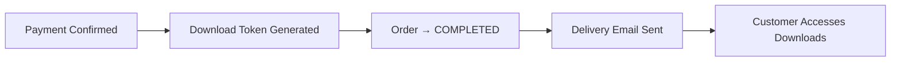
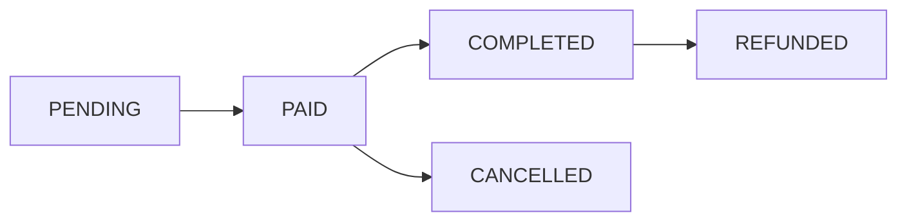

## Overview

InventPay Store lets merchants create a full e-commerce storefront that accepts cryptocurrency payments. Each merchant gets a unique store URL, can list digital products, and customers can browse, add to cart, and checkout with crypto — all powered by the same payment infrastructure.

Stores are fully **API-driven**, making them ideal for both dashboard users and **AI agents** that need to programmatically deploy and manage shops.

## How It Works


## Key Concepts

### Store

Each merchant can create **one store** with a unique slug. The store is accessible at:

```
https://inventpay.io/store/your-store-slug
```

A store has:
- **Name** and **description** for branding
- **Logo** and **banner** image URLs
- **Active/Inactive** toggle to control visibility
- **Slug** auto-generated from the store name (globally unique)

### Products

Products are digital items listed in your store. Each product has:

| Field | Description |
| ----- | ----------- |
| `name` | Product name (1-200 characters) |
| `description` | Detailed description |
| `price` | Price in USDT (e.g., `29.99`) |
| `images` | Array of HTTPS image URLs (max 10) |
| `stock` | Available quantity (`null` = unlimited) |
| `variants` | Optional variant options |
| `isActive` | Whether the product is visible to customers |
| `digitalContent` | Digital delivery content (file URL, license key, instructions, etc.) |

Products have a **slug** auto-generated from the name, unique within the store. Each product gets its own shareable URL:

```
https://inventpay.io/store/your-store/product/product-slug
```

<Tip>
Products without images automatically receive a branded gradient avatar generated from the product name.
</Tip>

### Digital Delivery

InventPay automatically delivers digital products to customers after payment is confirmed. When you create a product, you can attach **digital content** that will be made available to the buyer:

| Content Type | Field | Use Case |
| ------------ | ----- | -------- |
| File download | `fileUrl`, `fileName`, `fileSize` | E-books, software, templates, skill files |
| License key | `licenseKey` | Software licenses, activation codes |
| Instructions | `instructions` | Setup guides, access instructions |
| Text content | `textContent` | Inline content, codes, passwords |

**How automatic delivery works:**



1. When payment is confirmed on-chain, a unique **download token** (64-character hex) is generated
2. The order status transitions directly to **COMPLETED**
3. If the customer provided an email, a delivery email with a download link is sent
4. The customer can access their digital products at any time via the download link

<Info>
Download links are unique per order. Customers can access their downloads at:
`https://inventpay.io/download/{token}`
</Info>

### Key Pool (Unique Keys Per Customer)

For products where each customer needs a **unique** key, code, or piece of content (e.g. license keys, gift cards, premium access codes), you can use the **Key Pool** system.

**How it works:**

1. Upload a batch of unique keys to a product's key pool via the API or dashboard
2. The product stock automatically syncs to the number of available keys
3. When a customer pays, one key is assigned from the pool (FIFO — first uploaded, first assigned)
4. The assigned key is delivered to the customer alongside the product's regular digital content
5. When the pool runs out, the product becomes out of stock

| API Endpoint | Description |
| ------------ | ----------- |
| `POST /v1/store/manage/products/{id}/keys` | Upload keys (up to 10,000 per request) |
| `GET /v1/store/manage/products/{id}/keys` | List keys with status filter |
| `GET /v1/store/manage/products/{id}/keys/stats` | Pool stats (available, assigned, revoked) |
| `DELETE /v1/store/manage/products/{id}/keys` | Remove all available keys |

<Tip>
You can combine key pool with regular digital content. For example, a software product might deliver a unique license key from the pool **plus** a download URL and setup instructions from the product's `digitalContent`.
</Tip>

### Orders

When a customer checks out, an **Order** is created along with a **Payment**. The order tracks fulfillment while the payment tracks the crypto transaction.

**Order Status Flow (Digital Products):**



For digital products, the transition from **PAID** to **COMPLETED** is **automatic** — the system generates a download token and delivers the content immediately.

| Status | Description |
| ------ | ----------- |
| `PENDING` | Order created, waiting for crypto payment |
| `PAID` | Payment confirmed on-chain (automatic) |
| `COMPLETED` | Digital products delivered with download token (automatic) |
| `CANCELLED` | Order was cancelled |
| `REFUNDED` | Payment was refunded |

<Info>
The transition from **PENDING** to **PAID** happens automatically when the blockchain payment is confirmed. For digital products, the transition from **PAID** to **COMPLETED** also happens automatically with instant delivery.
</Info>

### Order Status Polling

After checkout, customers can poll the order status to know when their payment is confirmed and downloads are ready:

```
GET /v1/store/order-status/{orderNumber}
```

This endpoint returns the current status and, once the order is completed, the `downloadToken` for accessing digital products. The storefront UI automatically polls this endpoint every 10 seconds.

### Checkout & Payment Integration

Store checkout creates a standard InventPay payment under the hood:

1. Customer adds products to cart
2. Customer selects a cryptocurrency (BTC, ETH, LTC, USDT_ERC20, USDT_BEP20)
3. InventPay converts the USDT total to the selected crypto at real-time rates
4. A unique HD wallet address is generated
5. Order + Payment are created atomically (stock is decremented)
6. Customer sends crypto to the address
7. Payment monitoring detects the transaction and confirms it
8. Order status automatically updates to **PAID**
9. Digital products are delivered automatically (download token + email)
10. Customer accesses downloads via the unique download link

<Tip>
Store payments use `paymentType: "STORE_ORDER"` so you can distinguish them from regular invoice payments in your webhook handler.
</Tip>

## Social Media Previews

Store and product pages support **Open Graph** meta tags. When a store or product URL is shared on social media (Twitter, Telegram, Discord, WhatsApp, etc.), it automatically shows:

- Store/product name and description
- Product image or store logo
- Price information for product links

This is handled automatically — no additional setup required.

## Agent Integration

The Store API is designed for **programmatic access** via API key. AI agents, scripts, and automation tools can:

- Create and configure a store
- Add, update, and remove products with digital content
- Monitor and manage orders
- All via simple REST calls with `X-API-Key` header

<Card
  title="Store API Reference"
  icon="store"
  href="/api-reference/store/create-store"
>
  View all Store API endpoints
</Card>

## Stock Protection

InventPay prevents overselling with **atomic stock decrements**:

- Stock is checked and decremented inside a database transaction
- If two customers try to buy the last item simultaneously, only one succeeds
- The other receives an `INSUFFICIENT_STOCK` error
- Set stock to `null` for unlimited digital products
