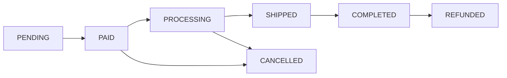

## Overview

InventPay Store lets merchants create a full e-commerce storefront that accepts cryptocurrency payments. Each merchant gets a unique store URL, can list products, and customers can browse, add to cart, and checkout with crypto — all powered by the same payment infrastructure.

Stores are fully **API-driven**, making them ideal for both dashboard users and **AI agents** that need to programmatically deploy and manage shops.

## How It Works


## Key Concepts

### Store

Each merchant can create **one store** with a unique slug. The store is accessible at:

```
https://inventpay.io/store/your-store-slug
```

A store has:
- **Name** and **description** for branding
- **Logo** and **banner** image URLs
- **Active/Inactive** toggle to control visibility
- **Slug** auto-generated from the store name (globally unique)

### Products

Products are items listed in your store. Each product has:

| Field | Description |
| ----- | ----------- |
| `name` | Product name (1-200 characters) |
| `description` | Detailed description |
| `price` | Price in USDT (e.g., `29.99`) |
| `images` | Array of HTTPS image URLs (max 10) |
| `stock` | Available quantity (`null` = unlimited) |
| `variants` | Optional variant options (size, color, etc.) |
| `isActive` | Whether the product is visible to customers |

Products have a **slug** auto-generated from the name, unique within the store.

### Orders

When a customer checks out, an **Order** is created along with a **Payment**. The order tracks fulfillment while the payment tracks the crypto transaction.

**Order Status Flow:**



| Status | Description |
| ------ | ----------- |
| `PENDING` | Order created, waiting for crypto payment |
| `PAID` | Payment confirmed on-chain (automatic) |
| `PROCESSING` | Merchant is preparing/fulfilling the order |
| `SHIPPED` | Order has been shipped |
| `COMPLETED` | Order delivered and complete |
| `CANCELLED` | Order was cancelled |
| `REFUNDED` | Payment was refunded |

<Info>
The transition from **PENDING** to **PAID** happens automatically when the blockchain payment is confirmed. All other transitions are managed by the merchant.
</Info>

### Checkout & Payment Integration

Store checkout creates a standard InventPay payment under the hood:

1. Customer adds products to cart
2. Customer selects a cryptocurrency (BTC, ETH, LTC, USDT_ERC20, USDT_BEP20)
3. InventPay converts the USDT total to the selected crypto at real-time rates
4. A unique HD wallet address is generated
5. Order + Payment are created atomically (stock is decremented)
6. Customer sends crypto to the address
7. Payment monitoring detects the transaction and confirms it
8. Order status automatically updates to **PAID**
9. Merchant webhooks fire as usual

<Tip>
Store payments use `paymentType: "STORE_ORDER"` so you can distinguish them from regular invoice payments in your webhook handler.
</Tip>

## Agent Integration

The Store API is designed for **programmatic access** via API key. AI agents, scripts, and automation tools can:

- Create and configure a store
- Add, update, and remove products
- Monitor and manage orders
- All via simple REST calls with `X-API-Key` header

<Card
  title="Store API Reference"
  icon="store"
  href="/api-reference/store/create-store"
>
  View all Store API endpoints
</Card>

## Stock Protection

InventPay prevents overselling with **atomic stock decrements**:

- Stock is checked and decremented inside a database transaction
- If two customers try to buy the last item simultaneously, only one succeeds
- The other receives an `INSUFFICIENT_STOCK` error
- Set stock to `null` for unlimited/digital products
