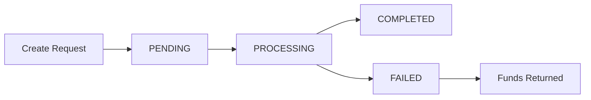

## Overview

Withdrawals allow you to transfer cryptocurrency from your InventPay account to any external wallet address. Understanding the withdrawal process helps you manage your funds efficiently and plan for fees and timing.

## What is a Withdrawal?

A withdrawal is a transfer of cryptocurrency from your InventPay available balance to an external wallet address that you control.

<CardGroup cols={2}>
  <Card title="Fast Processing" icon="bolt">
    Most withdrawals processed within minutes
  </Card>
  <Card title="Any Wallet" icon="wallet">
    Send to any valid wallet address
  </Card>
  <Card title="Automatic Fees" icon="calculator">
    Fees calculated automatically
  </Card>
  <Card title="Real-time Status" icon="signal">
    Track withdrawal status in real-time
  </Card>
</CardGroup>

## Withdrawal Lifecycle



### Withdrawal States

<AccordionGroup>
  <Accordion title="PENDING" icon="clock">
    **Initial State:** Withdrawal request created
    
    - Request validated
    - Balance and limits checked
    - Awaiting system processing
    
    **Duration:** Usually less than 1 minute
  </Accordion>

{" "}
<Accordion title="PROCESSING" icon="spinner">
  **Active State:** Transaction submitted to blockchain - Transaction
  broadcasted - Awaiting network confirmations - Transaction hash available
  **Duration:** Varies by network (see table below)
</Accordion>

{" "}
<Accordion title="COMPLETED" icon="circle-check">
  **Final State:** Withdrawal successfully confirmed - Required confirmations
  reached - Funds delivered to destination - Transaction complete **Duration:**
  N/A (final state)
</Accordion>

  <Accordion title="FAILED" icon="circle-xmark">
    **Final State:** Withdrawal failed
    
    - Error during processing
    - Funds automatically returned to balance
    - Can create new withdrawal
    
    **Duration:** N/A (final state)
  </Accordion>
</AccordionGroup>

## Withdrawal API Key

Programmatic withdrawals (via API, SDK, or MCP agents) require a **separate withdrawal API key** in addition to your standard API key. This is disabled by default for security.

<CardGroup cols={2}>
  <Card title="Dashboard Withdrawals" icon="browser">
    Use **2FA verification** — no withdrawal key needed
  </Card>
  <Card title="API / MCP Withdrawals" icon="code">
    Use **Withdrawal API Key** (`X-Withdrawal-Key` header)
  </Card>
</CardGroup>

### Setting Up Your Withdrawal API Key

<Steps>
  <Step title="Go to Settings">
    Navigate to **Dashboard → Settings → Withdrawal API Key**
  </Step>
  <Step title="Generate Key">
    Click **"Generate Key"** to create your withdrawal API key (format: `wk_live_...`)
  </Step>
  <Step title="Copy and Store">
    Copy the key immediately — it will only be shown once in full
  </Step>
  <Step title="Add to Your Integration">
    Include the key as `X-Withdrawal-Key` header in withdrawal API requests, or set it as `INVENTPAY_WITHDRAWAL_KEY` environment variable for MCP agents
  </Step>
</Steps>

<Warning>
  Anyone with your withdrawal API key can initiate withdrawals from your account.
  Keep it secret and revoke it immediately from the dashboard if compromised.
</Warning>

## Creating a Withdrawal

### Using the API

<CodeGroup>

```javascript JavaScript/TypeScript
const withdrawal = await fetch(
  "https://api.inventpay.io/v1/merchant/withdrawal/create",
  {
    method: "POST",
    headers: {
      "X-API-Key": process.env.INVENTPAY_API_KEY,
      "X-Withdrawal-Key": process.env.INVENTPAY_WITHDRAWAL_KEY,
      "Content-Type": "application/json",
    },
    body: JSON.stringify({
      amount: 100,
      currency: "USDT_BEP20",
      destinationAddress: "0x1E3D6848dE165e64052f0F2A3dA8823A27CAc22D",
      description: "Monthly payout",
    }),
  }
);

const data = await withdrawal.json();
console.log("Withdrawal ID:", data.data.withdrawalId);
console.log("Status:", data.data.status);
console.log("Net Amount:", data.data.netAmount);
```

```python Python
import requests

response = requests.post(
    "https://api.inventpay.io/v1/merchant/withdrawal/create",
    headers={
        "X-API-Key": "YOUR_API_KEY",
        "X-Withdrawal-Key": "YOUR_WITHDRAWAL_KEY",
        "Content-Type": "application/json",
    },
    json={
        "amount": 100,
        "currency": "USDT_BEP20",
        "destinationAddress": "0x1E3D6848dE165e64052f0F2A3dA8823A27CAc22D",
        "description": "Monthly payout",
    },
)

data = response.json()
print(f"Withdrawal ID: {data['data']['withdrawalId']}")
print(f"Status: {data['data']['status']}")
print(f"Net Amount: {data['data']['netAmount']}")
```

```bash cURL
curl -X POST https://api.inventpay.io/v1/merchant/withdrawal/create \
  -H "X-API-Key: YOUR_API_KEY" \
  -H "X-Withdrawal-Key: YOUR_WITHDRAWAL_KEY" \
  -H "Content-Type: application/json" \
  -d '{
    "amount": 100,
    "currency": "USDT_BEP20",
    "destinationAddress": "0x1E3D6848dE165e64052f0F2A3dA8823A27CAc22D",
    "description": "Monthly payout"
  }'
```

</CodeGroup>

<Card
  title="Create Withdrawal API"
  icon="code"
  href="/api-reference/create-withdrawal"
>
  View complete API documentation
</Card>

## Withdrawal Requirements

### Minimum Amounts

Each cryptocurrency has a minimum withdrawal amount:

| Currency   | Minimum Withdrawal | Reason                 |
| ---------- | ------------------ | ---------------------- |
| BTC        | 0.001 BTC (~$40)   | Network fee efficiency |
| ETH        | 0.01 ETH (~$20)    | Gas fee efficiency     |
| LTC        | 0.1 LTC (~$7)      | Network fee efficiency |
| USDT_ERC20 | 10 USDT            | Gas fee efficiency     |
| USDT_BEP20 | 10 USDT            | Processing efficiency  |
| SOL        | 0.1 SOL (~$15)     | Network fee efficiency |
| USDC_SOL   | 5 USDC             | Processing efficiency  |
| USDC_BEP20 | 5 USDC             | Processing efficiency  |

<Warning>
  Attempting to withdraw less than the minimum will result in an error. Network
  fees would consume too large a percentage of small withdrawals.
</Warning>

### Withdrawal Limits

**Daily Limits:**

- BTC: 10 BTC
- ETH: 50 ETH
- LTC: 500 LTC
- USDT: 10,000 USDT
- SOL: 500 SOL
- USDC: 10,000 USDC

**Monthly Limits:**

- BTC: 100 BTC
- ETH: 500 ETH
- LTC: 5,000 LTC
- USDT: 100,000 USDT
- SOL: 5,000 SOL
- USDC: 100,000 USDC

<Info>
  Limits reset automatically. Daily limits reset every 24 hours, monthly limits
  reset on the 1st of each month.
</Info>

### Balance Requirements

You must have sufficient available balance to cover:

1. Withdrawal amount
2. Network fee
3. Service fee (0.5%)

**Example Calculation:**

```
Withdrawal Request: 100 USDT
Service Fee (0.5%): 0.50 USDT
Network Fee: 0.10 USDT (estimated)
Required Balance: 100.60 USDT
```

## Withdrawal Fees

### Fee Structure

All withdrawals include two types of fees:

<CardGroup cols={2}>
  <Card title="Service Fee" icon="percent">
    **Rate:** 0.5% of withdrawal amount
    
    **Purpose:** Platform maintenance and support
    
    **Example:** 0.50 USDT on 100 USDT withdrawal
  </Card>

  <Card title="Network Fee" icon="network-wired">
    **Rate:** Variable (depends on blockchain)
    
    **Purpose:** Blockchain transaction cost
    
    **Example:** 0.10 USDT for BEP-20 transactions
  </Card>
</CardGroup>

### Fee Examples by Currency

| Currency   | Service Fee | Typical Network Fee | Total Fee (on 100 units) |
| ---------- | ----------- | ------------------- | ------------------------ |
| BTC        | 0.5%        | ~0.0001 BTC         | ~0.0006 BTC              |
| ETH        | 0.5%        | ~0.001 ETH          | ~0.006 ETH               |
| LTC        | 0.5%        | ~0.001 LTC          | ~0.006 LTC               |
| USDT_ERC20 | 0.5%        | ~$2-10              | ~$2.50-10.50             |
| USDT_BEP20 | 0.5%        | ~$0.10-0.50         | ~$0.60-1.00              |
| SOL        | 0.5%        | ~$0.001-0.01        | ~$0.50                   |
| USDC_SOL   | 0.5%        | ~$0.001-0.01        | ~$0.50                   |
| USDC_BEP20 | 0.5%        | ~$0.10-0.50         | ~$0.60-1.00              |

<Note>
  Network fees vary based on blockchain congestion. Fees shown are estimates and
  may be higher during peak times.
</Note>

### Fee Calculation Response

When you create a withdrawal, you'll receive a detailed fee breakdown:

```json
{
  "amount": "100",
  "feeAmount": "0.60",
  "metadata": {
    "netAmount": 100.0,
    "serviceFee": 0.5,
    "networkFee": 0.1
  }
}
```

## Processing Times

Withdrawal processing times vary by cryptocurrency:

| Cryptocurrency | Processing Time | Confirmations Required |
| -------------- | --------------- | ---------------------- |
| Bitcoin (BTC)  | 30-60 minutes   | 3 blocks               |
| Ethereum (ETH) | 10-30 minutes   | 12 blocks              |
| Litecoin (LTC) | 10-30 minutes   | 6 blocks               |
| USDT (ERC-20)  | 10-30 minutes   | 12 blocks              |
| USDT (BEP-20)  | 5-15 minutes    | 15 blocks              |
| Solana (SOL)   | 1-2 minutes     | Finalized              |
| USDC (Solana)  | 1-2 minutes     | Finalized              |
| USDC (BEP-20)  | 5-15 minutes    | 15 blocks              |

<Tip>
  **USDT_BEP20 is fastest:** If speed is important, consider using USDT on
  Binance Smart Chain for significantly faster withdrawals.
</Tip>

### Factors Affecting Speed

<AccordionGroup>
  <Accordion title="Network Congestion" icon="traffic-light">
    High transaction volume can slow processing
  </Accordion>

  <Accordion title="Gas Prices" icon="gas-pump">
    Higher gas prices can expedite Ethereum transactions
  </Accordion>

  <Accordion title="Time of Day" icon="clock">
    Some networks are busier during certain hours
  </Accordion>

  <Accordion title="Amount Size" icon="coins">
    Large amounts may receive priority processing
  </Accordion>
</AccordionGroup>

## Address Validation

InventPay validates all destination addresses before processing:

### Validation Checks

<Steps>
  <Step title="Format Validation">
    Ensures address matches cryptocurrency format
  </Step>
  <Step title="Checksum Verification">
    Verifies address checksum (for supported networks)
  </Step>
  <Step title="Network Matching">
    Confirms address is valid for selected network
  </Step>
  <Step title="Blacklist Check">Screens against known malicious addresses</Step>
</Steps>

### Address Format Examples

<CodeGroup>

```text Bitcoin (BTC)
bc1qxy2kgdygjrsqtzq2n0yrf2493p83kkfjhx0wlh
```

```text Ethereum (ETH)
0x742d35Cc6634C0532925a3b844Bc9e7595f0bEb
```

```text USDT (BEP-20)
0x742d35Cc6634C0532925a3b844Bc9e7595f0bEb
```

</CodeGroup>

<Warning>
  **Always double-check addresses!** Cryptocurrency transactions are
  irreversible. Sending to the wrong address means permanent loss of funds.
</Warning>

## Tracking Withdrawals

### Check Withdrawal Status

<CodeGroup>

```javascript JavaScript/TypeScript
const withdrawal = await sdk.getWithdrawal("withdrawal-id");

console.log("Status:", withdrawal.data.status);
console.log("TX Hash:", withdrawal.data.transactionHash);

if (withdrawal.data.status === "COMPLETED") {
  console.log("Completed at:", withdrawal.data.completedAt);
}
```

```python Python
withdrawal = sdk.get_withdrawal("withdrawal-id")

print(f"Status: {withdrawal.data['status']}")
print(f"TX Hash: {withdrawal.data.get('transactionHash')}")

if withdrawal.data['status'] == "COMPLETED":
    print(f"Completed at: {withdrawal.data['completedAt']}")
```

```bash cURL
curl -X GET https://api.inventpay.io/v1/withdrawal/withdrawal-id \
  -H "X-API-Key: YOUR_API_KEY"
```

</CodeGroup>

### Blockchain Explorer

Once processing, you can track your withdrawal on blockchain explorers:

| Network  | Explorer URL                                         |
| -------- | ---------------------------------------------------- |
| Bitcoin  | `https://blockchair.com/bitcoin/transaction/{hash}`  |
| Ethereum | `https://etherscan.io/tx/{hash}`                     |
| BSC      | `https://bscscan.com/tx/{hash}`                      |
| Litecoin | `https://blockchair.com/litecoin/transaction/{hash}` |
| Solana   | `https://solscan.io/tx/{hash}`                       |

<Card
  title="Get Withdrawal API"
  icon="magnifying-glass"
  href="/api-reference/get-withdrawal"
>
  View API documentation for checking withdrawal status
</Card>

## Failed Withdrawals

### Common Failure Reasons

<AccordionGroup>
  <Accordion title="Insufficient Network Funds" icon="gas-pump">
    **Cause:** Not enough funds to cover network fees **Solution:** System
    automatically retries with adjusted fees
  </Accordion>

  <Accordion title="Invalid Address" icon="location-crosshairs">
    **Cause:** Destination address format invalid **Solution:** Verify address
    and create new withdrawal
  </Accordion>

  <Accordion title="Network Issues" icon="wifi-slash">
    **Cause:** Blockchain network experiencing problems **Solution:** System
    automatically retries; wait or create new withdrawal
  </Accordion>

  <Accordion title="Rate Limit" icon="ban">
    **Cause:** Too many withdrawal attempts **Solution:** Wait 5 minutes and try
    again
  </Accordion>
</AccordionGroup>

### When a Withdrawal Fails

1. **Automatic Refund:** Funds returned to your available balance
2. **Notification:** Webhook sent (if configured)
3. **Failure Reason:** Check `failureReason` field
4. **Retry:** Create new withdrawal once issue is resolved

<Note>
  If a withdrawal fails, your balance is immediately credited back. There's no
  waiting period or manual refund process.
</Note>

## Security Measures

InventPay employs multiple security layers for withdrawals:

<CardGroup cols={2}>
  <Card title="Address Whitelisting" icon="list-check">
    Optional whitelist of approved addresses
  </Card>
  <Card title="Two-Factor Auth" icon="mobile-screen">
    2FA required for dashboard withdrawals
  </Card>
  <Card title="Withdrawal API Key" icon="key">
    Separate key required for programmatic withdrawals
  </Card>
  <Card title="Rate Limiting" icon="gauge-high">
    Automatic limits prevent abuse
  </Card>
  <Card title="Anomaly Detection" icon="shield-halved">
    AI-powered fraud detection
  </Card>
</CardGroup>

### Enable Enhanced Security

<Steps>
  <Step title="Enable 2FA">
    Require two-factor authentication for withdrawals
  </Step>
  <Step title="Set Up Whitelist">Pre-approve destination addresses</Step>
  <Step title="Configure Notifications">
    Get alerts for all withdrawal activity
  </Step>
  <Step title="Set Thresholds">
    Require manual approval for large withdrawals
  </Step>
</Steps>

## Best Practices

<AccordionGroup>
  <Accordion title="Verify Addresses" icon="check-double">
    Always double-check destination addresses before withdrawing
  </Accordion>

  <Accordion title="Test Small Amounts First" icon="vial">
    Send a small test transaction to new addresses
  </Accordion>

  <Accordion title="Consider Network Fees" icon="calculator">
    Choose networks with lower fees for smaller withdrawals
  </Accordion>

  <Accordion title="Monitor Limits" icon="chart-line">
    Track daily/monthly limits before large withdrawals
  </Accordion>

  <Accordion title="Use USDT_BEP20" icon="bolt">
    Fastest and cheapest option for USDT withdrawals
  </Accordion>

  <Accordion title="Regular Withdrawals" icon="calendar">
    Don't let large balances accumulate; withdraw regularly
  </Accordion>
</AccordionGroup>

## Withdrawal Scheduling

For businesses with regular payout needs:

### Automated Withdrawals

- Schedule recurring withdrawals
- Set up automatic payouts on specific dates
- Configure minimum balance triggers
- Multiple beneficiary addresses

<Card title="Contact Sales" icon="headset" href="mailto:sales@inventpay.io">
  Enterprise features available for high-volume merchants
</Card>

## Tax and Compliance

### Record Keeping

InventPay provides withdrawal records for tax purposes:

- Transaction history export (CSV, PDF)
- Detailed fee breakdowns
- Timestamp and amount records
- Blockchain transaction IDs

### Reporting

<Steps>
  <Step title="Access Dashboard">Log in to your InventPay dashboard</Step>
  <Step title="Navigate to Withdrawals">View complete withdrawal history</Step>
  <Step title="Export Data">Download records in your preferred format</Step>
  <Step title="Share with Accountant">Provide records to tax professional</Step>
</Steps>

## Troubleshooting

<AccordionGroup>
  <Accordion title="Withdrawal Stuck in PENDING" icon="circle-question">
    **Normal Duration:** Up to 5 minutes **If Longer:** Check system status or
    contact support
  </Accordion>

  <Accordion title="Lower Amount Received" icon="circle-question">
    **Cause:** Network and service fees deducted **Solution:** Review fee
    breakdown in withdrawal details
  </Accordion>

  <Accordion title="Cannot Withdraw Full Balance" icon="circle-question">
    **Cause:** Must reserve amount for fees **Solution:** Reduce withdrawal
    amount by ~1%
  </Accordion>

  <Accordion title="Address Rejected" icon="circle-question">
    **Cause:** Invalid format or wrong network **Solution:** Verify address
    matches currency network
  </Accordion>
</AccordionGroup>

## Next Steps

<CardGroup cols={2}>
  <Card
    title="Create Withdrawal"
    icon="rocket"
    href="/api-reference/create-withdrawal"
  >
    Start withdrawing your funds via API
  </Card>
  <Card
    title="Check Status"
    icon="circle-info"
    href="/api-reference/get-withdrawal"
  >
    Learn to track withdrawal status
  </Card>
  <Card title="View Balance" icon="wallet" href="/concepts/balances">
    Check your available balance
  </Card>
  <Card title="Dashboard" icon="gauge" href="https://inventpay.io/dashboard">
    Manage withdrawals in dashboard
  </Card>
</CardGroup>
