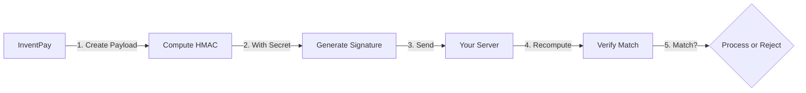

## Overview

Webhooks are HTTP callbacks sent from InventPay to your server. Since they can trigger critical business logic (like order fulfillment), securing your webhook endpoint is essential to prevent fraud and unauthorized access.

<Warning>
  **Never skip security measures.** An unsecured webhook endpoint can be
  exploited to trigger fraudulent order fulfillment or other malicious actions.
</Warning>

## Security Threats

Understanding potential threats helps you implement appropriate defenses:

<CardGroup cols={2}>
  <Card title="Replay Attacks" icon="rotate">
    Attacker resends captured webhook to trigger duplicate actions
  </Card>
  <Card title="Forgery Attacks" icon="user-secret">
    Attacker sends fake webhooks pretending to be InventPay
  </Card>
  <Card title="Man-in-the-Middle" icon="wifi">
    Attacker intercepts and modifies webhooks in transit
  </Card>
  <Card title="Denial of Service" icon="ban">
    Attacker floods your endpoint with requests
  </Card>
</CardGroup>

## Essential Security Measures

### 1. Signature Verification (Required)

Every webhook includes an HMAC-SHA256 signature in the `X-Webhook-Signature` header. **Always verify this signature** before processing webhooks.

#### How Signature Verification Works



#### Implementation

<CodeGroup>

```javascript Node.js
const crypto = require("crypto");

function verifyWebhookSignature(payload, signature, secret) {
  // Compute expected signature
  const expectedSignature = crypto
    .createHmac("sha256", secret)
    .update(JSON.stringify(payload))
    .digest("hex");

  // Use timing-safe comparison to prevent timing attacks
  return crypto.timingSafeEqual(
    Buffer.from(signature),
    Buffer.from(expectedSignature)
  );
}

// In your webhook handler
app.post("/webhook", (req, res) => {
  const signature = req.headers["x-webhook-signature"];
  const isValid = verifyWebhookSignature(
    req.body,
    signature,
    process.env.WEBHOOK_SECRET
  );

  if (!isValid) {
    return res.status(401).json({ error: "Invalid signature" });
  }

  // Process webhook...
});
```

```python Python
import hmac
import hashlib

def verify_webhook_signature(payload: str, signature: str, secret: str) -> bool:
    """Verify webhook signature using HMAC-SHA256"""
    expected_signature = hmac.new(
        secret.encode(),
        payload.encode(),
        hashlib.sha256
    ).hexdigest()

    # Use constant-time comparison to prevent timing attacks
    return hmac.compare_digest(signature, expected_signature)

# In your webhook handler
@app.route('/webhook', methods=['POST'])
def handle_webhook():
    signature = request.headers.get('X-Webhook-Signature')
    payload = request.get_data(as_text=True)

    if not verify_webhook_signature(payload, signature, WEBHOOK_SECRET):
        return jsonify({'error': 'Invalid signature'}), 401

    # Process webhook...
```

```php PHP
function verifyWebhookSignature($payload, $signature, $secret) {
    $expectedSignature = hash_hmac('sha256', $payload, $secret);

    // Use constant-time comparison
    return hash_equals($signature, $expectedSignature);
}

// In your webhook handler
$signature = $_SERVER['HTTP_X_WEBHOOK_SIGNATURE'];
$payload = file_get_contents('php://input');

if (!verifyWebhookSignature($payload, $signature, $webhookSecret)) {
    http_response_code(401);
    exit('Invalid signature');
}

// Process webhook...
```

</CodeGroup>

<Tip>
  **Critical**: Use the **raw request body** for signature verification, not the
  parsed JSON object. Body parsers may modify the structure.
</Tip>

#### Common Signature Verification Mistakes

<AccordionGroup>
  <Accordion title="❌ Using Parsed JSON" icon="xmark">
    **Wrong:**
    ```javascript
    const signature = crypto
      .createHmac('sha256', secret)
      .update(req.body) // req.body is already parsed object
      .digest('hex');
    ```
    
    **Right:**
    ```javascript
    const signature = crypto
      .createHmac('sha256', secret)
      .update(req.rawBody) // Use raw string
      .digest('hex');
    ```
  </Accordion>

{" "}
<Accordion title="❌ Wrong Secret" icon="xmark">
  Make sure you're using the webhook secret from your dashboard, not your API
  key.
</Accordion>

  <Accordion title="❌ Insecure Comparison" icon="xmark">
    **Wrong:**
    ```javascript
    if (signature === expectedSignature) // Vulnerable to timing attacks
    ```
    
    **Right:**
    ```javascript
    if (crypto.timingSafeEqual(
      Buffer.from(signature),
      Buffer.from(expectedSignature)
    ))
    ```
  </Accordion>
</AccordionGroup>

---

### 2. HTTPS Only (Required)

**Never accept webhooks over HTTP.** Always use HTTPS to prevent:

- Man-in-the-middle attacks
- Eavesdropping
- Payload tampering

```javascript
// Reject HTTP requests
if (req.protocol !== "https") {
  return res.status(403).json({ error: "HTTPS required" });
}
```

<Warning>
  InventPay will **reject** webhook URLs that use HTTP protocol. Only HTTPS URLs
  are accepted.
</Warning>

---

### 3. Idempotency (Required)

Implement idempotency to handle duplicate webhook deliveries safely. Use the `X-Webhook-ID` header or payment ID to track processed webhooks.

#### Why Idempotency Matters

Webhooks may be delivered multiple times due to:

- Network retries
- Timeout retries
- Manual redelivery

Without idempotency, you might:

- Fulfill the same order twice
- Charge customer twice
- Send duplicate notifications

#### Implementation

<CodeGroup>

```javascript Node.js with Database
// Store processed webhook IDs in database
async function handleWebhook(req, res) {
  const webhookId = req.headers["x-webhook-id"];

  // Check if already processed
  const alreadyProcessed = await db.webhookDeliveries.findOne({
    webhookId: webhookId,
  });

  if (alreadyProcessed) {
    console.log("Webhook already processed:", webhookId);
    return res.status(200).json({ received: true, duplicate: true });
  }

  // Process webhook
  await processWebhookEvent(req.body);

  // Mark as processed
  await db.webhookDeliveries.create({
    webhookId: webhookId,
    processedAt: new Date(),
    event: req.body.event,
    paymentId: req.body.data.paymentId,
  });

  res.status(200).json({ received: true });
}
```

```javascript Node.js with Redis
const redis = require("redis");
const client = redis.createClient();

async function handleWebhook(req, res) {
  const webhookId = req.headers["x-webhook-id"];

  // Check if already processed (exists in Redis)
  const exists = await client.exists(`webhook:${webhookId}`);

  if (exists) {
    console.log("Webhook already processed:", webhookId);
    return res.status(200).json({ received: true, duplicate: true });
  }

  // Process webhook
  await processWebhookEvent(req.body);

  // Mark as processed (TTL: 7 days)
  await client.setex(`webhook:${webhookId}`, 604800, Date.now());

  res.status(200).json({ received: true });
}
```

```python Python with Database
async def handle_webhook(request):
    webhook_id = request.headers.get('X-Webhook-ID')

    # Check if already processed
    already_processed = await db.webhook_deliveries.find_one({
        'webhook_id': webhook_id
    })

    if already_processed:
        logger.info(f'Webhook already processed: {webhook_id}')
        return jsonify({'received': True, 'duplicate': True}), 200

    # Process webhook
    await process_webhook_event(request.json)

    # Mark as processed
    await db.webhook_deliveries.insert_one({
        'webhook_id': webhook_id,
        'processed_at': datetime.utcnow(),
        'event': request.json.get('event'),
        'payment_id': request.json.get('data', {}).get('paymentId')
    })

    return jsonify({'received': True}), 200
```

</CodeGroup>

<Info>
  Store webhook IDs for at least 7 days to handle retries. After 7 days,
  InventPay stops retrying failed webhooks.
</Info>

---

### 4. IP Whitelisting (Optional)

For additional security, whitelist InventPay's IP addresses:

```
52.89.214.238
34.212.75.30
54.218.53.128
```

#### Implementation

<CodeGroup>

```javascript Express.js
const INVENTPAY_IPS = ["52.89.214.238", "34.212.75.30", "54.218.53.128"];

app.post("/webhook", (req, res) => {
  const clientIP =
    req.headers["x-forwarded-for"] || req.connection.remoteAddress;

  if (!INVENTPAY_IPS.includes(clientIP)) {
    return res.status(403).json({ error: "IP not whitelisted" });
  }

  // Process webhook...
});
```

```nginx NGINX
# In nginx.conf
location /webhook {
    allow 52.89.214.238;
    allow 34.212.75.30;
    allow 54.218.53.128;
    deny all;

    proxy_pass http://localhost:3000;
}
```

```apache Apache
# In .htaccess
<Files "webhook">
    Order Deny,Allow
    Deny from all
    Allow from 52.89.214.238
    Allow from 34.212.75.30
    Allow from 54.218.53.128
</Files>
```

</CodeGroup>

<Warning>
  IP addresses may change. We recommend signature verification as the primary
  security method, with IP whitelisting as secondary defense.
</Warning>

---

### 5. Rate Limiting (Recommended)

Implement rate limiting to prevent abuse:

<CodeGroup>

```javascript Express Rate Limit
const rateLimit = require("express-rate-limit");

const webhookLimiter = rateLimit({
  windowMs: 1 * 60 * 1000, // 1 minute
  max: 100, // Max 100 requests per minute
  message: "Too many webhook requests",
  standardHeaders: true,
  legacyHeaders: false,
});

app.post("/webhook", webhookLimiter, handleWebhook);
```

```python Flask-Limiter
from flask_limiter import Limiter
from flask_limiter.util import get_remote_address

limiter = Limiter(
    app,
    key_func=get_remote_address,
    default_limits=["100 per minute"]
)

@app.route('/webhook', methods=['POST'])
@limiter.limit("100 per minute")
def handle_webhook():
    # Process webhook...
```

</CodeGroup>

---

### 6. Timestamp Validation (Recommended)

Reject webhooks that are too old to prevent replay attacks:

```javascript
function isRecentWebhook(timestamp, maxAgeMinutes = 5) {
  const webhookTime = new Date(timestamp);
  const now = new Date();
  const ageMinutes = (now - webhookTime) / 1000 / 60;

  return ageMinutes <= maxAgeMinutes;
}

app.post("/webhook", (req, res) => {
  const timestamp = req.headers["x-webhook-timestamp"];

  if (!isRecentWebhook(timestamp, 5)) {
    return res.status(400).json({ error: "Webhook too old" });
  }

  // Process webhook...
});
```

---

## Additional Security Measures

### Authentication Tokens

Add custom authentication to your webhook URL:

```
https://yourapp.com/webhook?token=your-secret-token
```

```javascript
app.post("/webhook", (req, res) => {
  if (req.query.token !== process.env.WEBHOOK_AUTH_TOKEN) {
    return res.status(401).json({ error: "Invalid token" });
  }

  // Process webhook...
});
```

### Firewall Rules

Configure firewall to only accept traffic from InventPay IPs:

```bash
# UFW (Ubuntu)
ufw allow from 52.89.214.238 to any port 443
ufw allow from 34.212.75.30 to any port 443
ufw allow from 54.218.53.128 to any port 443
```

### Separate Endpoint

Use a dedicated subdomain or path for webhooks:

```
✅ https://webhooks.yourapp.com/inventpay
✅ https://api.yourapp.com/webhooks/inventpay
❌ https://yourapp.com/webhook
```

### Request Size Limits

Limit webhook payload size to prevent DoS:

```javascript
app.use("/webhook", express.json({ limit: "100kb" }));
```

---

## Security Checklist

Before going live, verify:

<AccordionGroup>
  <Accordion title="✓ Signature Verification" icon="check">
    - [ ] Using HMAC-SHA256 with correct secret
    - [ ] Verifying with raw request body
    - [ ] Using constant-time comparison
  </Accordion>

{" "}
<Accordion title="✓ HTTPS Only" icon="check">
  - [ ] Webhook URL uses HTTPS - [ ] Valid SSL certificate - [ ] Rejecting HTTP
  requests
</Accordion>

{" "}
<Accordion title="✓ Idempotency" icon="check">
  - [ ] Tracking processed webhook IDs - [ ] Handling duplicates gracefully - [
  ] Using database or cache
</Accordion>

{" "}
<Accordion title="✓ Rate Limiting" icon="check">
  - [ ] Implemented rate limits - [ ] Appropriate limits configured - [ ]
  Returning proper error codes
</Accordion>

{" "}
<Accordion title="✓ Logging" icon="check">
  - [ ] Logging all webhook deliveries - [ ] Logging security violations - [ ]
  Monitoring for suspicious activity
</Accordion>

  <Accordion title="✓ Error Handling" icon="check">
    - [ ] Graceful error handling
    - [ ] Returning appropriate status codes
    - [ ] Not exposing sensitive errors
  </Accordion>
</AccordionGroup>

---

## Secret Management

### Storing Secrets Securely

<CardGroup cols={2}>
  <Card title="Environment Variables" icon="server">
    ```bash INVENTPAY_WEBHOOK_SECRET=your_secret_here ```
  </Card>

  <Card title="Secret Manager" icon="vault">
    Use AWS Secrets Manager, Azure Key Vault, or HashiCorp Vault
  </Card>

  <Card title="Never in Code" icon="code">
    ❌ Never hardcode secrets in source code
  </Card>

  <Card title="Never in Logs" icon="file-lines">
    ❌ Never log webhook secrets
  </Card>
</CardGroup>

### Rotating Secrets

Periodically rotate your webhook secret:

<Steps>
  <Step title="Generate New Secret">Create new secret in dashboard</Step>
  <Step title="Update Application">Deploy new secret to your servers</Step>
  <Step title="Test">Verify webhooks work with new secret</Step>
  <Step title="Revoke Old Secret">Remove old secret from dashboard</Step>
</Steps>

---

## Monitoring and Alerts

### What to Monitor

- Failed signature verifications
- Unusual webhook volume
- Old timestamp attacks
- Repeated webhook IDs
- IP address mismatches

### Setting Up Alerts

```javascript
// Alert on suspicious activity
if (failedVerifications > 5) {
  alertSecurityTeam("Multiple failed webhook verifications");
}

if (oldTimestamp) {
  alertSecurityTeam("Potential replay attack detected");
}
```

---

## Incident Response

If you suspect a security breach:

<Steps>
  <Step title="Rotate Secrets Immediately">
    Generate new webhook secret in dashboard
  </Step>
  <Step title="Review Logs">Check for unauthorized webhook deliveries</Step>
  <Step title="Verify Orders">
    Audit recent orders for fraudulent fulfillment
  </Step>
  <Step title="Contact Support">
    Email security@inventpay.io with incident details
  </Step>
  <Step title="Implement Additional Security">
    Add extra security layers based on findings
  </Step>
</Steps>

---

## Next Steps

<CardGroup cols={2}>
  <Card title="Setup Guide" icon="wrench" href="/webhooks/setup">
    Configure webhooks securely
  </Card>
  <Card title="Event Reference" icon="list" href="/webhooks/events">
    View all webhook events
  </Card>
  <Card title="Code Examples" icon="code" href="/sdks/javascript/examples">
    See secure webhook implementations
  </Card>
  <Card title="Dashboard" icon="gauge" href="https://inventpay.io/dashboard">
    Manage webhook settings
  </Card>
</CardGroup>
